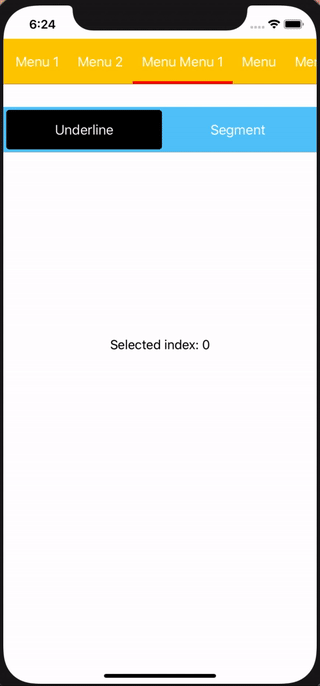

# MenuBarView

A UIView derivative for menu view

## Requirements
- iOS 9.0+

## Installation

### Swift Package Manager

Once you have your Swift package set up, adding the library as a dependency is as easy as adding it to the dependencies value of your Package.swift.

dependencies: [
    .package(url: "https://github.com/saddamakhtar88/MenuBarView.git", .upToNextMajor(from: "1.0.0"))
]

## Public APIs

### Functions 
- setMenu(labels: [String], defaultActive: Int = 0)

### Properties
- activeMenuIndex: Int
- contentEdgeInset: UIEdgeInsets?
- menuSpacing: CGFloat = 8
- activeMenuHighlightHeight: CGFloat = 8
- activeMenuHighlightColor = UIColor.red
- bottomBorderHeight : CGFloat = 0.5
- bottomBorderColor = UIColor.lightGray

## Delegate <MenuBarProtocol>
- func onActiveMenuChange(index: Int)
- func decorateMenu(button: UIButton, forIndex: Int)
